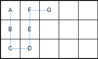

# 041 箱子之字形摆放

## 题目描述

有一批箱子（形式为字符串，设为`str`），要求将这批箱子按从上到下以之字形的顺序摆放在宽度为`n`的空地，请输出箱子的摆放位置。

例如：箱子ABCDEFG，空地宽度为3，摆放结果如图：



则输出结果为：
```text
AFG
BE
CD
```

## 输入描述

输入一行字符串，通过空格分隔，前面部分为字母或数字组成的字符串`str`，表示箱子；后面部分为数字`n`，表示空地的宽度。

例如：
```text
ABCDEFG 3
```

**备注：**
1. 请不要在最后一行输出额外的空行。
2. `str`只包含字母和数字，字符串长度的取值范围是1 <= len(str) <= 1000。
3. `n`的取值范围是1 <= n <= 1000。

## 输出描述

箱子摆放结果，如题目示例所示。

## 示例描述

### 示例一

**输入：**
```text
ABCDEFG 3
```

**输出：**
```text
AFG
BE
CD
```

## 解题思路

1. 初始化位置索引`index`为0。
2. 初始化顺序标识`asc`，`True`表示从上到下，`False`表示从下到上。
3. 遍历字符串：
    - 如果位置索引到了最前面，则顺序标识为`True`，索引为0。
    - 如果位置索引到了最末尾，则顺序标识为`False`，索引为`n-1`。
    - 将结果列表上对应的位置存入该字符。
    - 根据顺序标识，改变位置索引。
4. 返回结果列表。

## 解题代码

```python
def solve_method(chars, n):
    result = ["" for _ in range(n)]
    index = 0
    # 标识：True表示从上到下，False表示从下到上
    asc = True

    for c in chars:
        if index == -1:
            index = 0
            asc = True
        if index == n:
            index = n - 1
            asc = False
        result[index] += c

        if asc:
            index += 1
        else:
            index -= 1

    return result


if __name__ == '__main__':
    assert solve_method("ABCDEFG", 3) == ["AFG", "BE", "CD"]
```