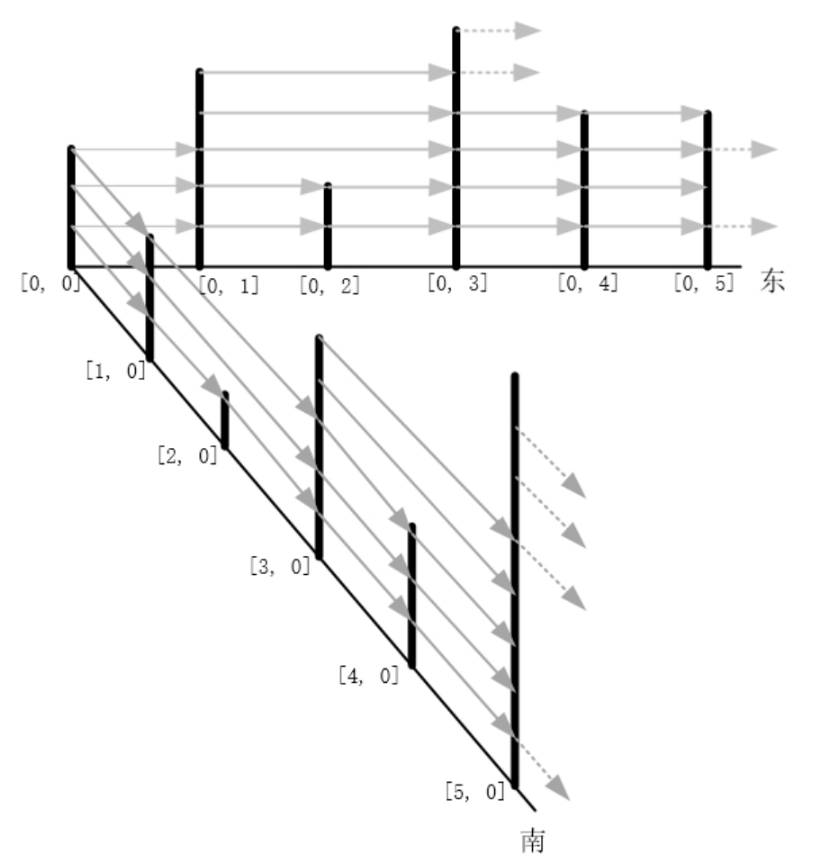

## 009 信号发射和接收

## 题目描述

有一个二维的天线矩阵，每根天线可以向其他天线发射信号，也能接收其他天线的信号，为了简化起见，我们约定每根天线只能向东和向南发射信号，换言之，每根天线只能接收东向或南向的信号。

每根天线有自己的高度`anth`，每根天线的高度存储在一个二维数组中，各个天线的位置用`[r, c]`表示，`r`代表天线的行位置（从0开始编号），`c`代表天线的列位置（从0开始编号）。

在某一方向（东向或南向），某根天线可以收到多根其他天线的信号（也可能收不到任何其他天线的信号），对任一天线`X`和天线`Y`，天线`X`能接收到天线`Y`的条件是：
- 天线`X`在天线`Y`的东边或南边。  
- 天线`X`和天线`Y`之间的其他天线的高度都低于天线`X`和天线`Y`，或天线`X`和天线`Y`之间无其他天线，即无遮挡。  

如下图示意：  



在天线矩阵的第0行上：

- 天线`[0, 0]`接收不到任何其他天线的信号。
- 天线`[0, 1]`可以接收到天线`[0, 0]`的信号。
- 天线`[0, 2]`可以接收到天线`[0, 1]`的信号。
- 天线`[0, 3]`可以接收到天线`[0, 1]`和天线`[0, 2]`的信号。
- 天线`[0, 4]`可以接收到天线`[0, 3]`的信号。
- 天线`[0, 5]`可以接收到天线`[0, 4]`的信号。

在天线的第0列上：

- 天线`[0, 0]`接收不到任何其他天线的信号。
- 天线`[1, 0]`可以接收到天线`[0, 0]`的信号。
- 天线`[2, 0]`可以接收到天线`[1, 0]`的信号。
- 天线`[3, 0]`可以接收到天线`[1, 0]`和天线`[2, 0]`的信号。
- 天线`[4, 0]`可以接收到天线`[3, 0]`的信号。
- 天线`[5, 0]`可以接收到天线`[3, 0]`和天线`[4, 0]`的信号。  

给一个`m`行`n`列的矩阵（二维数组），矩阵存储各根天线的高度，求出每根天线可以接收到多少根其他天线的信号，结果输出到`m`行`n`列的矩阵（二维矩阵）中。

## 输入描述

输入为1个`m`行`n`列的矩阵（二维矩阵）`anth[m][n]`，矩阵存储各根天线的高度，高度值`anth[r][c]`为大于0的整数。

第一行是输入矩阵的行数和列数，如：`m n`。

第二行为输入矩阵的元素值，按行输入，如：  
```text
anth[0][0] anth[0][1] ... anth[0][n-1] anth[1][0] anth[1][1] ... anth[1][n-1] ... anth[m-1][0] ... anth[m-1][n-1]
```

## 输出描述

输出一个`m`行`n`列的矩阵（二维数组）`ret[m][n]`，矩阵存储每根天线能收到多少根其他天线的信号，根数为`ret[r][c]`。

第一行是输出矩阵的行数和列数，如:`m n`。

第二行是输出矩阵的元素值，按行输出，如：
```text
ret[0][0] ret[0][1] ... ret[0][n-1] ret[1][0] ret[1][1] ... ret[1][n-1] ... ret[m-1][0] ... ret[m-1][n-1]
```

## 备注

- 1 <= m <= 500
- 1 <= n <= 500
- 0 < anth[r][c] < 10^5

## 示例描述

### 示例一

**输入：**
```text
1 6
2 4 1 5 3 3
```

**输出：**
```text
1 6
0 1 1 2 1 1
```

**说明：**  

输入为1行6列的天线矩阵的高度值`[2 4 1 5 3 3]` 

输出为1行6列的结果矩阵`[0 1 1 2 1 1]`

### 示例二

**输入：**
```text
2 6
2 5 4 3 2 8 9 7 5 10 10 3
```

**输出：**
```text
2 6
0 1 1 1 1 4 1 2 2 4 2 2
```

**说明：**  
输入为2行6列的天线矩阵高度值：
```text
[2 5 4 3 2 8]
[9 7 5 10 10 3]
```

输出为2行6列的结果矩阵：
```text
[0 1 1 1 1 4]
[1 2 2 4 2 2]
```

- 天线`[0, 0]`收不到任何其他天线的信号，因此`ret[0,0] = 0`。
- 天线`[0, 1]`可接收到天线`[0, 0]`的信号，因此`ret[0, 1] = 1`。
- 天线`[0, 2]`可以接收到天线`[0, 1]`的信号，因此`ret[0, 2] = 1`。
- 天线`[0, 3]`可以接收到天线`[0, 2]`的信号，因此`ret[0, 3] = 1`。
- 天线`[0, 4]`可以接收到天线`[0, 3]`的信号，因此`ret[0, 4] = 1`。
- 天线`[0, 5]`可以接收到天线`[0, 1]`、天线`[0, 2]`、天线`[0, 3]`、天线`[0, 4]`的信号，因此`ret[0, 5] = 4`。

- 天线`[1, 0]`可以接收到天线`[0, 0]`的信号，因此`ret[1, 0] = 1`。
- 天线`[1, 1]`可以接收到天线`[0, 1]`、天线`[1, 0]`的信号，因此`ret[1, 1] = 2`。
- 天线`[1, 2]`可以接收到天线`[0, 2]`、天线`[1, 1]`的信号，因此`ret[1, 2] = 2`。
- 天线`[1, 3]`可以接收到天线`[0, 3]`、天线`[1, 0]`、天线`[1, 1]`、天线`[1, 2]`的信号，因此`ret[1, 3] = 4`。
- 天线`[1, 4]`可以接收到天线`[0, 4]`、天线`[1, 3]`的信号，因此`ret[1, 4] = 2`。
- 天线`[1, 5]`可以接收到天线`[0, 5]`、天线`[1, 4]`的信号，因此`ret[1, 5] = 2`。

## 解题思路

1. 逐个遍历所有天线：
    - 遍历南向的后续天线，判断是否能接收到当前天线的信号，如果能收到，则对应`ret`累加1。
    - 遍历东向的后续天线，判断是否能接收到当前天线的信号，如果能收到，则对应`ret`累加1。
2. 判断是否能收到当前天线函数`can_receive`：
    - 如果相邻，一定能接收到信号，返回`True`。
    - 判断中间是否有阻碍：
        - 如果起始天线矮于下一个天线，则无法接收到，返回`False`。
        - 如果中间最高的天线高于终点天线，则无法接收到，返回`False`。
3. 返回每个天线能接收到的天线数量。

## 解题代码
```python
def can_receive(ant_heights):
    # 如果相邻，一定能接收到信号
    if len(ant_heights) == 2:
        return True

    start_ant = ant_heights[0]
    end_ant = ant_heights[len(ant_heights) - 1]
    next_ant_idx = 1
    temp_height = 0

    # 判断中间是否有阻碍
    while next_ant_idx < len(ant_heights) - 1:
        next_ant = ant_heights[next_ant_idx]
        # 如果起始天线矮于下一个天线，则无法接收到
        if start_ant <= next_ant:
            return False

        temp_height = max(temp_height, next_ant)
        # 如果中间最高的天线高于终点天线，则无法接收到
        if temp_height >= end_ant:
            return False

        next_ant_idx += 1

    return True


def solve_method(rows: int, cols: int, ant_heights: list[list[int]]):
    ret = [[0] * cols for _ in range(rows)]

    for i in range(rows):
        for j in range(cols):
            if i != rows - 1:
                k = i + 1
                ant_cols = [row[j] for row in ant_heights]
                # 遍历南向的后续天线，判断是否能接收到当前天线的信号
                while k < rows:
                    if can_receive(ant_cols[i: k + 1]):
                        ret[k][j] += 1
                    k += 1
            if j != cols - 1:
                k = j + 1
                # 遍历东向的后续天线，判断是否能接收到当前天线的信号
                while k < cols:
                    if can_receive(ant_heights[i][j: k + 1]):
                        ret[i][k] += 1
                    k += 1

    return rows, cols, ret


if __name__ == '__main__':
    heights = [[2, 4, 1, 5, 3, 3]]
    output = [[0, 1, 1, 2, 1, 1]]
    assert solve_method(1, 6, heights) == (1, 6, output)

    heights = [[2, 5, 4, 3, 2, 8], [9, 7, 5, 10, 10, 3]]
    output = [[0, 1, 1, 1, 1, 4], [1, 2, 2, 4, 2, 2]]
    assert solve_method(2, 6, heights) == (2, 6, output)
```