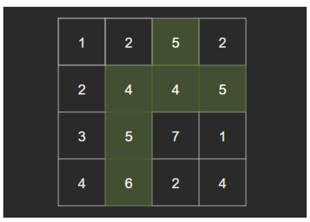

# 033 机器人活动区域

## 题目描述

现有一个机器人，可放置于`M*N`的网格中任意位置，每个网格包含一个非负整数编号。当相邻网格的数字编号差值的绝对值小于等于1时，机器人可以在网格间移动。

问题：求机器人可活动的最大范围对应的网格点数目。

说明：
1．网格左上角坐标为`(0,0)`，右下角坐标为`(m-1,n-1)`。
2．机器人只能在相邻网格间上下左右移动。

## 输入描述

第一行输入为`M`和`N`，`M`表示网格的行数，`N`表示网格的列数。

之后`M`行表示网格数值，每行`N`个数值（数值大小用`k`表示），数值间用单个空格分隔，行首行尾无多余空格。其中`M`、`N`、`k`均为整数，且1 <= M, N <= 150、0 <= k <= 50。

## 输出描述

输出一行，包含1个数字，表示最大活动区域的网格点数目。行首行尾无多余空格。

## 示例描述

### 示例一

**输入：**
```text
4 4
1 2 5 2
2 4 4 5
3 5 7 1
4 6 2 4
```

**输出：**
```text
6
```

**说明：**



图中绿色区域，相邻网格差值绝对值都小于等于1，且为最大区域，对应网格点数目为6。

### 示例二

**输入：**
```text
2 3
1 3 5
4 1 3
```

**输出：**
```text
1
```

**说明：**

任意两个相邻网格的差值绝对值都大于1，机器人不能在网格间移动，只能在单个网格内活动，对应网格点数目为1。

## 解题思路

**代码思路：** 使用深度优先搜索DFS求解。
1. 遍历所有的网格：
    - 初始化已访问的网格列表`visited`，1表示已访问过，0表示未访问过。
    - 使用深度优先搜索，得到满足条件的最大网格数：
        - 确定参数：网格大小`M`和`N`、网格列表`matrix`、当前位置`i`和`j`、已访问的网格列表`visited`
        - 终止条件：如果出界，或周围网格点已经访问到，或相邻网格差值绝对值不满足要求，则返回网格数。
        - 递归处理：如果在边界内，并且周围网格点有未访问的，且满足绝对值小于等于1，则继续递归。
2. 返回最大网格数。    

## 解题代码
```python
def dfs(M, N, matrix, i, j, visited):
    count = 1
    visited[i][j] = 1
    for x, y in [[1, 0], [-1, 0], [0, 1], [0, -1]]:
        if 0 <= i + x < M and 0 <= j + y < N:
            if not visited[i + x][j + y] and abs(matrix[i + x][j + y] - matrix[i][j]) <= 1:
                count += dfs(M, N, matrix, i + x, j + y, visited)
    return count


def solve_method(M, N, matrix):
    maxCount = 0
    # 遍历所有可能的起始位置
    for i in range(M):
        for j in range(N):
            visited = [[0] * N for _ in range(M)]
            maxCount = max(maxCount, dfs(M, N, matrix, i, j, visited))
    return maxCount


if __name__ == "__main__":
    # 4 4
    # 1 2 5 2
    # 2 4 4 5
    # 3 5 7 1
    # 4 6 2 4
    # M网格行数，N网格列数
    # M, N = map(int, input().split())
    # matrix = []
    # for _ in range(M):
    #     matrix.append(list(map(int, input().split())))
    # print(solve_method(M, N, matrix))

    assert solve_method(4, 4, [[1, 2, 5, 2], [2, 4, 4, 5], [3, 5, 7, 1], [4, 6, 2, 4]]) == 6
    assert solve_method(2, 3, [[1, 3, 5], [4, 1, 3]]) == 1
```